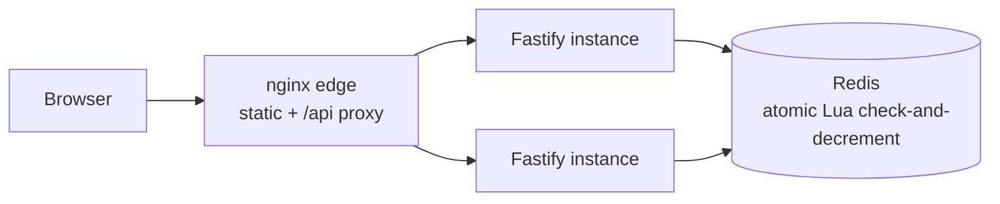

# Flash Sale System

A high-throughput flash sale platform: one product, limited stock, one item per user, no overselling under load. Take-home project.

- [Project instructions](./INSTRUCTIONS.md)

## Architecture



All correctness lives in one place: a Lua script inside Redis that checks the
buyer set and stock and mutates both atomically — safe across any number of
stateless app instances. The sale window is enforced with a clock read before
any store round trip, so out-of-window traffic costs almost nothing. Dev runs
the same logic on an in-memory store (event-loop atomic, zero setup); both
implementations pass an identical contract suite in CI.

Full diagrams and the scaling path: [docs/system-diagram.md](docs/system-diagram.md).

## Design choices

The short version of every trade-off; the ADRs carry the full reasoning.

- **TypeScript monorepo** — npm workspaces: `apps/server`, `apps/web`, `packages/api-types` ([ADR-0002](docs/adr/0002-monorepo-npm-workspaces.md), [ADR-0003](docs/adr/0003-typescript.md))
- **Fastify** — best throughput of the allowed frameworks; the sale logic stays framework-agnostic ([ADR-0004](docs/adr/0004-fastify.md))
- **Dual store: in-memory by default, Redis opt-in** — atomic on the Node event loop for zero-setup runs; the same logic as an atomic Lua script for the distributed shape; one contract test suite proves both behave identically ([ADR-0005](docs/adr/0005-in-memory-plus-redis.md))
- **No auth: bare `userId`** — the brief's identity model; production would pass a verified JWT claim with the store contract unchanged. Considered and rejected: self-minted JWT, simulated IdP, Better Auth ([ADR-0009](docs/adr/0009-api-surface.md))
- **Env-var config** — the sale window is immutable per-run config; a sale database is unasked scope ([ADR-0010](docs/adr/0010-configuration.md))
- **Overload behavior** — microsecond hot path, instant rejections after sellout; rate limiting left to the load balancer ([ADR-0011](docs/adr/0011-overload-behavior.md))
- **Infra via artifacts** — Dockerfile, compose mode, CI, and production topology docs; no local cluster ([ADR-0006](docs/adr/0006-infra-via-artifacts.md))
- **Vitest for correctness, k6 for load** — one TS-native runner for behavior, an industry-standard generator for throughput numbers ([ADR-0007](docs/adr/0007-vitest-and-k6.md))
- **React + Vite + Chakra** — the frontend is 20% of the role; the time budget follows ([ADR-0008](docs/adr/0008-react-vite-chakra.md))
- **One origin for frontend and API** — Vite proxy in dev, nginx edge in compose; no CORS anywhere ([ADR-0012](docs/adr/0012-frontend-serving.md))

## Running

### Dev (npm only)

```
npm install
cp apps/server/.env.example apps/server/.env   # set a sale window around now
npm run dev:server                             # http://localhost:3000
npm run dev:web                                # http://localhost:5173
```

### Full stack via Docker (optional)

Production-shaped: nginx serves the frontend and proxies `/api`, the server runs against Redis.

```
cp .env.example .env                            # set the sale window + stock
docker compose up --build                       # http://localhost:8080
```

## Stress tests

Correctness under concurrency is asserted by the Vitest contract/concurrency suites in CI. The k6 suites below prove throughput and latency; install [k6](https://grafana.com/docs/k6/latest/set-up/install-k6/) (or use the Docker image as shown), build the server, and run against it:

```
npm run build -w apps/server
SALE_START=<past> SALE_END=<future> STOCK=100 node apps/server/dist/server.js &
docker run --rm --network host -i grafana/k6 run -e STOCK=100 -e BUYERS=5000 -e VUS=500 - < perf/purchase-burst.ts
docker run --rm --network host -i grafana/k6 run -e VUS=200 -e DURATION=20s - < perf/post-sellout.ts
```

Measured locally (single in-memory process, k6 in Docker; absolute numbers are machine-dependent — the exact-count assertions are the point):

| Suite | Load | Result |
|---|---|---|
| `purchase-burst` | 5,000 buyers, 500 concurrent, stock 100 | exactly 100 sold / 4,900 `sold_out`, 0 failures, ~9.6k req/s, med 19ms, p90 38ms (p95 tail is first-wave queueing) |
| `post-sellout` | 200 VUs for 20s after sellout | 340k requests, 100% instant 410s, p95 13ms, ~17k req/s |

Both suites also run as small smoke profiles in CI, so the exact-count assertions (no oversell, no failed requests) are enforced on every push.
