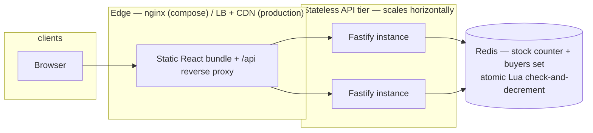
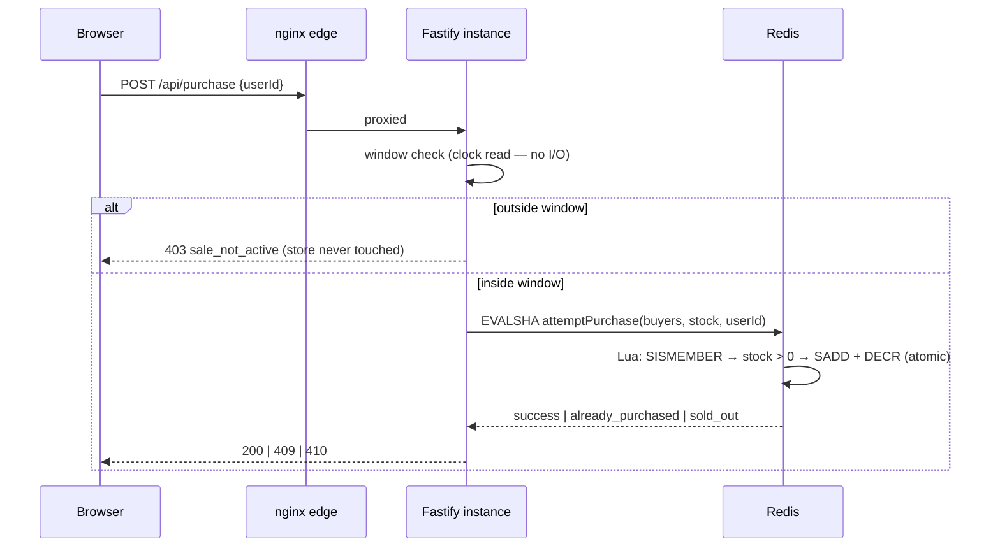
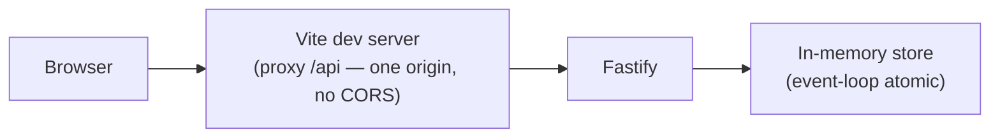

# System Diagram

The deployed shape, as built and as it would scale. The docker-compose stack runs
the bottom diagram's topology on one machine: nginx is the edge (static files +
`/api` reverse proxy), Fastify is stateless, and all mutable sale state lives in
Redis behind an atomic Lua script.

## Architecture

Two invariants hold everywhere:

- **No oversell / one per user** — the stock check, the dedupe check, and the
  mutation happen inside one atomic unit: a Lua script inside Redis, safe across
  any number of app instances ([ADR-0005](adr/0005-in-memory-plus-redis.md)).
- **Sale window** — enforced at the route with a clock read before any store
  round trip, so traffic outside the window never touches Redis
  ([ADR-0011](adr/0011-overload-behavior.md)).

The in-memory store used in dev and tests is the same logic with the atomicity
provided by the Node event loop instead — single-process only, zero setup.

## One purchase, end to end

After sellout the hot path is a clock read plus a single Redis script that
immediately rejects — measured at p95 13ms under a sustained 200-VU flood
(see the stress-test section of the README).

## Scaling path

1. **More Fastify instances** — they are stateless; Redis is the only shared
   state, and the Lua script keeps it correct under any fan-out. The compose
   stack models this with one instance; production adds replicas behind the LB.
2. **Redis** — a single Redis handles ~100k ops/s of scripts like ours; the
   first real bottleneck is vertical (bigger Redis), not app-tier.
3. **Managed over self-run** — for a small team, managed Redis plus a managed
   container platform (Fly/Render/ECS) delivers this topology without owning a
   cluster. Self-run Kubernetes is explicitly rejected in
   [ADR-0006](adr/0006-infra-via-artifacts.md).

## Development mode

Both modes share the same routes, contract types, and tests; the store swaps by
configuration ([ADR-0010](adr/0010-configuration.md)).
